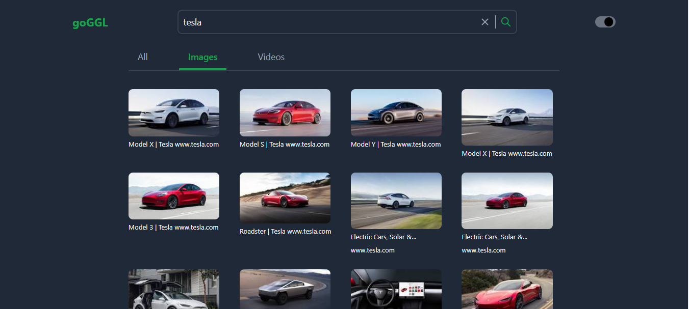

# google-clone

A simple clone of the Google search page you can use to search for info, images and videos made available by a [Google Search API](https://rapidapi.com/tuangeek/api/seo-api) from RapidApi.


### Screenshot

<details>
<summary>Screenshot</summary>



</details>


## Link

- [Live Site](https://search-goggl.netlify.app/)


## Recommended IDE Setup

[VSCode](https://code.visualstudio.com/) + [Volar](https://marketplace.visualstudio.com/items?itemName=johnsoncodehk.volar) (and disable Vetur) + [TypeScript Vue Plugin (Volar)](https://marketplace.visualstudio.com/items?itemName=johnsoncodehk.vscode-typescript-vue-plugin).

## Customize configuration

See [Vite Configuration Reference](https://vitejs.dev/config/).


### API KEY
Get your api key from [RapidApi](https://rapidapi.com/tuangeek/api/seo-api). <br>
Create a .env file at the root and fill it with your api key following the format in the .env-example file.


## Project Setup

```sh
npm install
```

### Compile and Hot-Reload for Development

```sh
npm run dev
```

### Compile and Minify for Production

```sh
npm run build
```
